<!--- -->
# Development

## 1. Install [Wordpress](https://developer.wordpress.org/advanced-administration/before-install/howto-install/) on your local environment
 - a. Tip: use [Local](https://localwp.com/) WordPress development tool for simplicity.
 - b. Follow this tutorial for instructions. This is one of best tool out there when it comes to installing WordPress on your own PC, Mac or Linux computer. It is free, easy to install and easy to configure! And yes, it is better than ServerPress. It also has more options than ServerPress. With "Local" By Flywheel it’s possible to go live from your own computer so that the app cab be shown/shared with clients and thus track the development.

## 2. Now, open your terminal and clone the repository. 

 -  ```bash     
     # git clone command followed by the URL of the repository to clone the app
     git clone https://github.com/myhumbee/widgetwebclient.git
     
     # Git will now download the entire repository to your local machine.
     # If the repository is private or requires authentication, 
     # you may be prompted to provide your credentials, such as your username and password or an access token. 
     # Additionally, if you have SSH set up for Git, you can use the SSH URL instead of the HTTPS URL for cloning. 
     # This can be helpful if you want to avoid entering your credentials each time. 
     # The SSH URL follows a similar format but starts with git@ instead of https://.
     ```
 - if you are using MacOS and get and error like: xcrun: error: invalid active developer path (... missing xcrun at: ..., run the following command. See this link for more information.
 -  ```bash
     xcode-select --install
     ```
 ## 3. Navigate to the root directory of your the react app that we just cloned.
 - Open with Code
     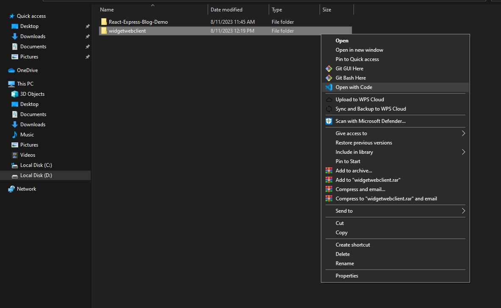
  -  ```bash
     cd frontend
     ```
     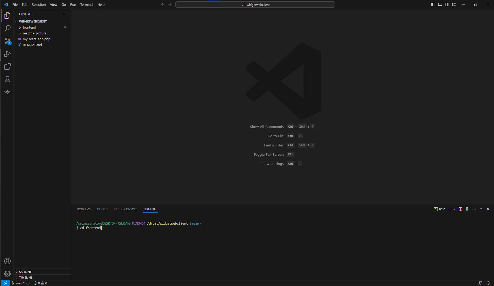

 ## 4. Now, build the app with the following command
   -  ```bash
         # then install dependencies again by npm install
         yarn install
         
         # finally, create an optimised production build...
         # This command will trigger the build process defined in the "scripts" section of your app's package.json file. 
         # Typically, it will create an optimised and production-ready version of your React app in a build or dist folder within your app's directory.
         yarn build
      ```
      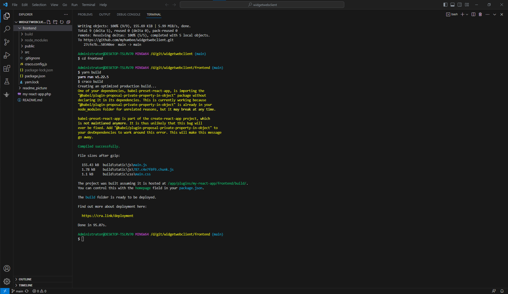

 ## 5. Except only the build file in the widgetwebclient project and delete all.
-    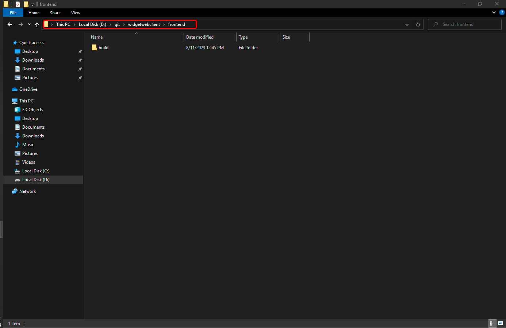
-    And then Remove except frontend folder and php file in widgetwebclient.
-    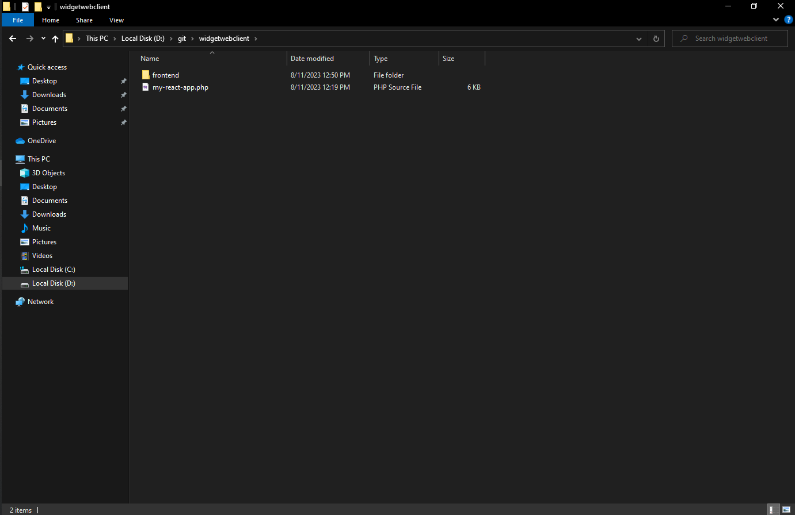
 ## 6. Compress widgetwebclient project into a .zip file 
- This is React App plugin.
   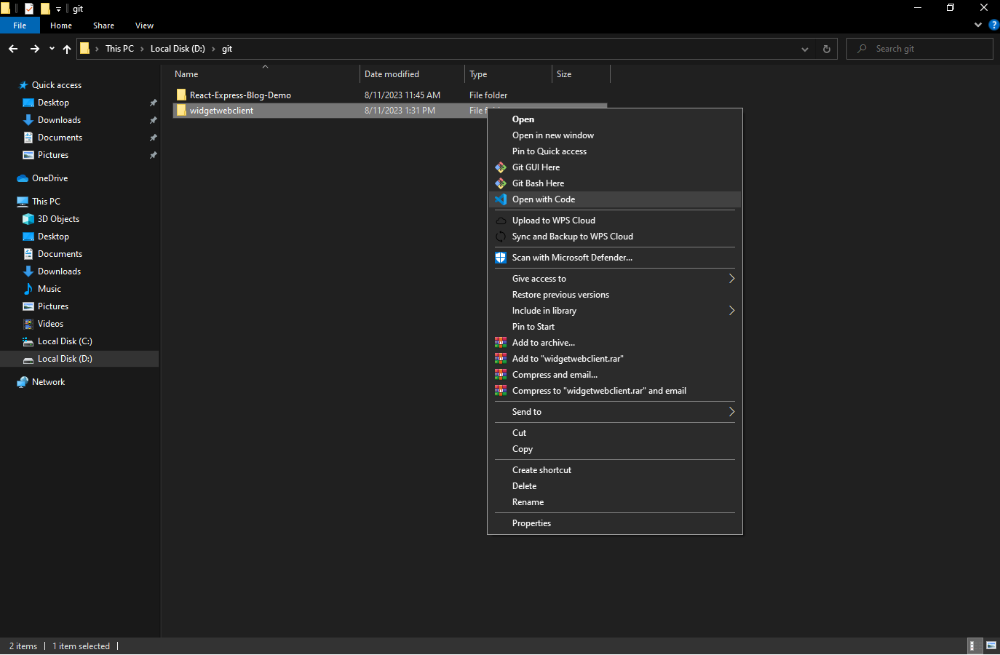
 ## 7. Run the WordPress Project.
 - At first, install the widgetwebclient plugin in wordpress.
   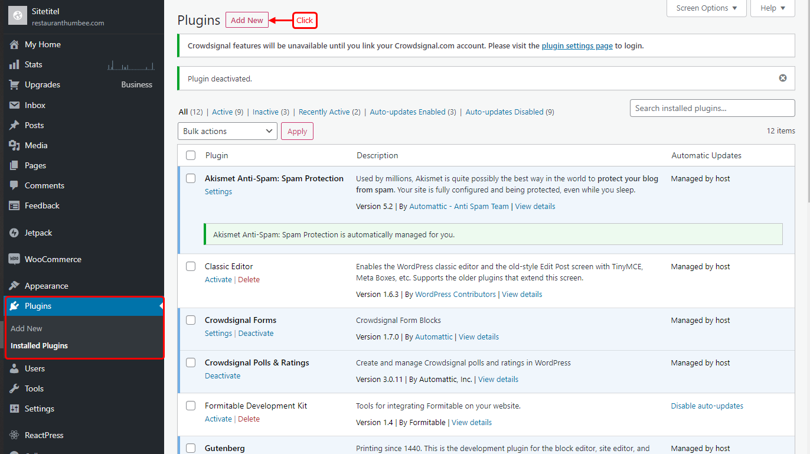
   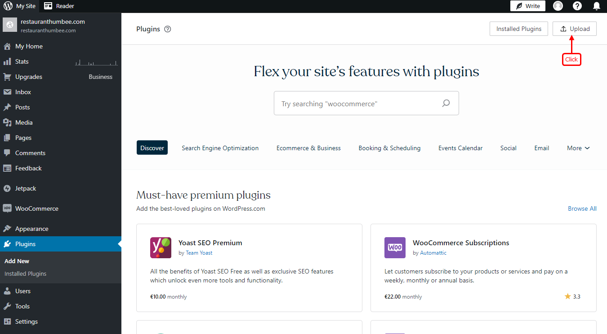
   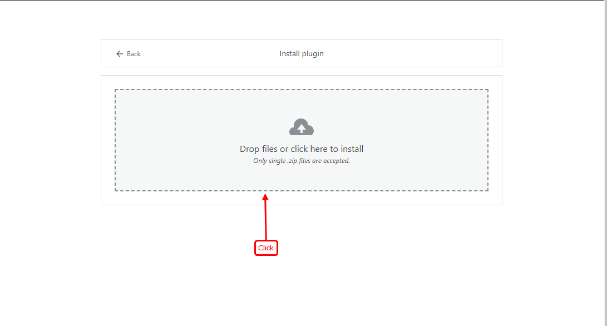
   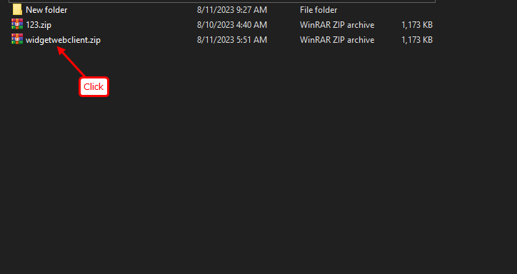
   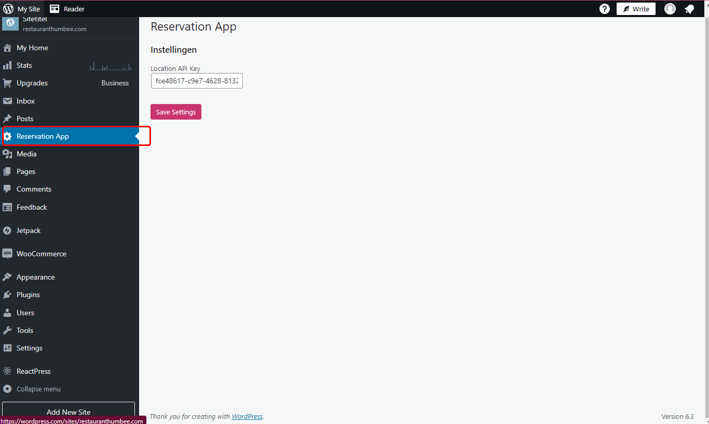
   


